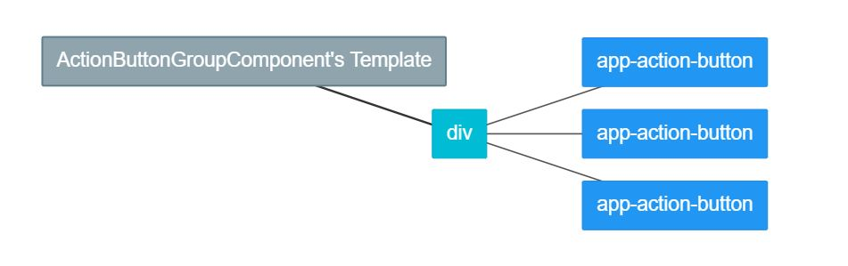
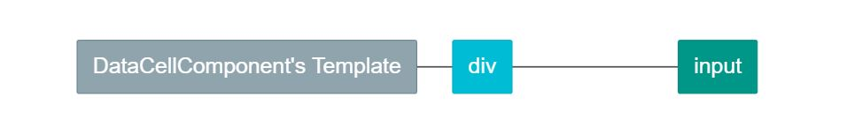
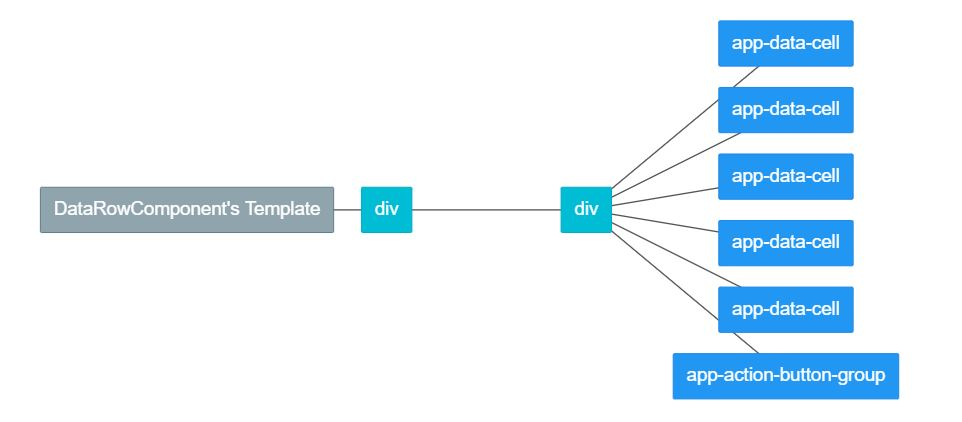
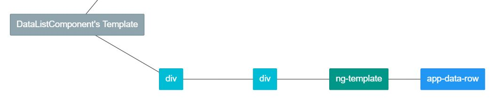

# Angular Component gyakorlás

## Kezdő lépések
- Lépj be a letöltött mappába és állítsd be a projektet:
- `cd ang-basic-practice005-comp-shock`
- `code . -r`
- Telepítsd a függőségeket:
- `npm i`
- Indítsd el az Angular Development Server -t:
- `npm start`

## Feladatok
- FONTOS! Adatkötésekkel dolgozz, semmilyen adatot ne fixálj a .html állományokban!
- PONTOSAN A KÖVETKEZŐ SORRENDBEN KÉSZÍTSD EL A KOMPONENSEKET!

## 1. Icon

- Feladata: egy megadott font-awesome ikont jelenít meg.
- Létrehozás: `ng g c common/icon`
> TUDÁS: ha az a componens neve, hogy `icon`, az osztály `IconComponent` lesz, a szelektor pedig `app-icon`.

<!-- //Microsoft Windows [Version 10.0.18363.1316]
(c) 2019 Microsoft Corporation. Minden jog fenntartva.

D:\programteszt\prog-teacher\ang-basic-practice005-comp-shock\ang-basic-practice005-comp-shock>ng g common/icon
'ng' is not recognized as an internal or external command,
operable program or batch file.

D:\programteszt\prog-teacher\ang-basic-practice005-comp-shock\ang-basic-practice005-comp-shock>npm i -g @angular/cli
npm WARN deprecated request@2.88.2: request has been deprecated, see https://github.com/request/request/issues/3142
npm WARN deprecated har-validator@5.1.5: this library is no longer supported
npm ERR! code EEXIST
npm ERR! path C:\Users\pin.janos\AppData\Roaming\npm\node_modules\@angular\cli\node_modules\@npmcli\move-file\node_modules\.bin\rimraf.ps1
npm ERR! Refusing to delete C:\Users\pin.janos\AppData\Roaming\npm\node_modules\@angular\cli\node_modules\@npmcli\move-file\node_modules\.bin\rimraf.ps1: ../rimraf/bin.js symlink target is not controlled by npm C:\Users\pin.janos\AppData\Roaming\npm\node_modules\@angular\cli\node_modules\@npmcli\move-file\node_modules\rimraf
npm ERR! File exists: C:\Users\pin.janos\AppData\Roaming\npm\node_modules\@angular\cli\node_modules\@npmcli\move-file\node_modules\.bin\rimraf.ps1     ps1
npm ERR! Remove the existing file and try again, or run npm
npm ERR! with --force to overwrite files recklessly.

npm ERR! A complete log of this run can be found in:
npm ERR!     C:\Users\pin.janos\AppData\Roaming\npm-cache\_logs\2021-02-04T22_06_46_490Z-debug.log

D:\programteszt\prog-teacher\ang-basic-practice005-comp-shock\ang-basic-practice005-comp-shock>node -v
v14.15.4

D:\programteszt\prog-teacher\ang-basic-practice005-comp-shock\ang-basic-practice005-comp-shock>npm

Usage: npm <command>

where <command> is one of:
    access, adduser, audit, bin, bugs, c, cache, ci, cit,
    clean-install, clean-install-test, completion, config,
    create, ddp, dedupe, deprecate, dist-tag, docs, doctor,
    edit, explore, fund, get, help, help-search, hook, i, init,
    install, install-ci-test, install-test, it, link, list, ln,
    login, logout, ls, org, outdated, owner, pack, ping, prefix,
    profile, prune, publish, rb, rebuild, repo, restart, root,
    run, run-script, s, se, search, set, shrinkwrap, star,
    stars, start, stop, t, team, test, token, tst, un,
    uninstall, unpublish, unstar, up, update, v, version, view,
    whoami

npm <command> -h  quick help on <command>
npm -l            display full usage info
npm help <term>   search for help on <term>
npm help npm      involved overview

Specify configs in the ini-formatted file:
    C:\Users\pin.janos\.npmrc
or on the command line via: npm <command> --key value
Config info can be viewed via: npm help config

npm@6.14.10 C:\Program Files\nodejs\node_modules\npm

D:\programteszt\prog-teacher\ang-basic-practice005-comp-shock\ang-basic-practice005-comp-shock>ng g common/icon
'ng' is not recognized as an internal or external command,
operable program or batch file.

D:\programteszt\prog-teacher\ang-basic-practice005-comp-shock\ang-basic-practice005-comp-shock>npm install -g --force gatsby-cli
npm WARN using --force I sure hope you know what you are doing.
npm WARN deprecated @hapi/joi@15.1.1: Switch to 'npm install joi'
npm WARN deprecated @hapi/bourne@1.3.2: This version has been deprecated and is no longer supported or maintained
npm WARN deprecated @hapi/topo@3.1.6: This version has been deprecated and is no longer supported or maintained
npm WARN deprecated @hapi/address@2.1.4: Moved to 'npm install @sideway/address'
npm WARN deprecated @hapi/hoek@8.5.1: This version has been deprecated and is no longer supported or maintained
C:\Users\pin.janos\AppData\Roaming\npm\gatsby -> C:\Users\pin.janos\AppData\Roaming\npm\node_modules\gatsby-cli\cli.js

> gatsby-telemetry@1.10.0 postinstall C:\Users\pin.janos\AppData\Roaming\npm\node_modules\gatsby-cli\node_modules\gatsby-telemetry
> node src/postinstall.js || true


> gatsby-cli@2.19.1 postinstall C:\Users\pin.janos\AppData\Roaming\npm\node_modules\gatsby-cli
> node scripts/postinstall.js

╔════════════════════════════════════════════════════════════════════════╗
║                                                                        ║
║   Gatsby collects anonymous usage analytics                            ║
║   to help improve Gatsby for all users.                                ║
║                                                                        ║
║   If you'd like to opt-out, you can use `gatsby telemetry --disable`   ║
║   To learn more, checkout https://gatsby.dev/telemetry                 ║
║                                                                        ║
╚════════════════════════════════════════════════════════════════════════╝
Success!

Welcome to the Gatsby CLI! Please visit https://www.gatsbyjs.org/docs/gatsby-cli/ for more information.


+ gatsby-cli@2.19.1
added 557 packages from 637 contributors in 62.019s

D:\programteszt\prog-teacher\ang-basic-practice005-comp-shock\ang-basic-practice005-comp-shock>gatsby telemetry --disable
Telemetry collection disabled


D:\programteszt\prog-teacher\ang-basic-practice005-comp-shock\ang-basic-practice005-comp-shock>ng g common/icon
'ng' is not recognized as an internal or external command,
operable program or batch file. 

töröltem a nodejs-t majd újra telepítettem az sem oldotta meg, azután a vs code -ot is töröltem újra telepítettem, újra raktam a typescriptet, az angulart, és most ez a hiba


D:\programteszt\prog-teacher\ang-basic-practice005-comp-shock\ang-basic-practice005-comp-shock>ng g c common/icon
internal/modules/cjs/loader.js:311
      throw err;
      ^

Error: Cannot find module 'C:\Users\pin.janos\AppData\Roaming\npm\node_modules\@angular\cli\node_modules\symbol-observable\lib\index.js'. Please verify that the package.json has a valid "main" entry
    at tryPackage (internal/modules/cjs/loader.js:303:19)
    at Function.Module._findPath (internal/modules/cjs/loader.js:516:18)
    at Function.Module._resolveFilename (internal/modules/cjs/loader.js:867:27)
    at Function.Module._load (internal/modules/cjs/loader.js:725:27)
    at Module.require (internal/modules/cjs/loader.js:952:19)
    at require (internal/modules/cjs/helpers.js:88:18)
    at Object.<anonymous> (C:\Users\pin.janos\AppData\Roaming\npm\node_modules\@angular\cli\lib\init.js:10:1)
    at Module._compile (internal/modules/cjs/loader.js:1063:30)
    at Object.Module._extensions..js (internal/modules/cjs/loader.js:1092:10)
    at Module.load (internal/modules/cjs/loader.js:928:32) {
  code: 'MODULE_NOT_FOUND',
  path: 'C:\\Users\\pin.janos\\AppData\\Roaming\\npm\\node_modules\\@angular\\cli\\node_modules\\symbol-observable\\package.json',
  requestPath: 'symbol-observable'
}-->


- Bejövő adat: `@Input() icon: string = '';`
> TUDÁS: a bejövő adat, amit vár a komponens az icon, ami egy 
változó lesz az osztályban. 

- Nézet: `<i class="fa" [class]="icon"></i>`
> TUDÁS: itt látszik, hogy alapból font-awesome -al dolgozik, és külön meg van adva még egy osztály, property-binding segítségével, ami a konkrét ikont határozza meg. Ez az icon a 
bejövő adat.

## 2. ActionButton

- Feladata: egy ikonnal ellátott Bootstrap gombot jelenít meg és lekezeli a 
kattintás eseményét.
- Létrehozás: action-button
- Bejövő adat: `@var icon {string}, @default 'fa-pen'`
> TUDÁS: ez a megadási forma egy olyan inputot jelent, ami így néz ki 
`@Input() icon: string = 'fa-pen';`  

- Bejövő adat: `@var btnClass {string}, @default 'btn-info'`
- Bejövő adat: `@var text {string}, @default ''`
- Kimenő esemény: `@Output() clicked: EventEmitter<boolean> = new EventEmitter();`
> TUDÁS: ezzel az eseménnyel értesíti az action-button a szülő komponensét, hogy 
kattintás történt benne. Erre azért van szükség, mert nem lát bele a szülő a 
komponensbe. A `<boolean>` azt jelenti, hogy az adat, ami az eseményben 
át lesz adva, boolean típusú lesz.  

- Metódus: 
```typescript
onUserCliced(): void {
  this.clicked.emit(true);
}
```
> TUDÁS: ahhoz, hogy le tudjam kezelni a gombra kattintást, kell egy 
eseménykezelő metódus, amit a typescript osztályban definiálok. A következő 
kódban azt láthatod, hogyan kötöm össze ezt a metódust a click eseménnyel. 
Ennek a metódusnak nincs paramétere, mivel csak a kattintás ténye a lényeges.

- Nézet:  
```html
<button (click)="onUserCliced()" class="btn" [class]="btnClass">
  <app-icon [icon]="icon"></app-icon>
  {{ text }}
</button>
```
> TUDÁS: beállítottam egy eseményt, ha a gombra kattintanak, beállítottam a 
gomb osztályát, amit külső változóból kapok, beszúrtam gyermek komponensként az 
app-icon komponenst és átadtam neki az icon változóban kapott class nevet, 
megjelenítettem a gomb tartalmában a kapott szöveget. Ha nem akarok szöveget, 
akkor üres string -et adok át az app-acion-button komponensnek.

## 3. ActionButtonGroup

- Feladata: több akció gombot foglal egy csoportba és lekezeli a kattintás 
eseményüket.
- Létrehozás: action-button-group
- Kimenő esemény: `@var selectClick {EventEmitter<boolean>}`
> TUDÁS: a komment alapján létrehozott output esemény így néz ki 
`@Output() selectClick: EventEmitter<boolean> = new EventEmitter();`  

- Kimenő esemény: `@var updateClick {EventEmitter<boolean>}`
- Kimenő esemény: `@var deleteClick {EventEmitter<boolean>}`
> TUDÁS: a három esemény akkor fog megtörténni, ha a gombcsoporton belül 
valamelyik gombra rákattintanak, minden gombhoz a hozzá rendelt funkció 
szerint.

- Metódus: 
```typescript
onSelectButtonClick(): void {
  this.selectClick.emit(true);
}
```
> TUDÁS: a későbbiekben így fogom a metódusokat megadni, a következő minta 
megegyezik a fent láthatóval: 
`@method onSelectButtonClick {void}, a selectClick esemény true értékkel`  

- Metódus: `@method onUpdateButtonClick {void}, az updateClick esemény`
- Metódus: `@method onDeleteButtonClick {void}, az deleteClick esemény`
- Nézet: `<div class="btn-group">...</div>` 
ebben a divben helyezz el három `app-action-button` -t és mindegyiknek állítsd 
be az ikonját és a hozzá tartozó eseményt értelemszerűen. A három gomb: 
kiválasztás, frissítés, törlés. Példa: 
```html
<app-action-button
    [btnClass]="'btn-info'"
    [icon]="'fa-eye'"
    (clicked)="onSelectButtonClick()"
></app-action-button>
```
> TUDÁS: beállítottam a gomb osztályát, a benne megjelenő ikont és azt is, 
hogy mi történjen, ha rákattintanak. Ne feledd, ebből három különböző kell a 
három művelethez.

## 4. DataCellComponent

- Feladata: input meuőt jelenít meg a kapott objektum és a kapott kulcs alapján 
beállított értékkel.
- Létrehozás: data-cell
- Bejövő adat: `@var data {User}, @default new User()`
- Bejövő adat: `@var key {string}, @default ''`
- Nézet: legyen egy dived, adj neki fentről 1em margót. Ebben helyezz el egy 
input mezőt, formázd meg Bootstrap -el. Az input mezőt így kösd össze az adattal:
`[(ngModel)]="data[key]"`
> TUDÁS: az ngModel egy speciális Angular direktíva. Két irányú adatkötést tesz 
lehetővé, azaz nem csak átvesz adatot az osztálytól, hanem módosítani is tudja 
azt. Jele banana in the box, azaz property és event binding egyszerre. Tipikusan 
form elemekhez használják, mint az input, select vagy textarea.

## 5. DataRowComponent

- Feladata: egy adatsort jelenít meg a hozzá tartozó gomokkal, lekezeli a 
gombokra való kattintást.
- Létrehozás: data-row
- Bejövő adat: `@var dataRow {User}, @default new User()`
- Kimenő esemény: `@var selectClick {EventEmitter<boolean>}`
- Kimenő esemény: `@var updateClick {EventEmitter<boolean>}`
- Kimenő esemény: `@var deleteClick {EventEmitter<boolean>}`
- Metódus: `@method onSelectClicked {void}, selectClick eseményt hívja a dataRow -val`
- Metódus: `@method onUpdateClicked {void}, updateClick eseményt hívja a dataRow -val`
- Metódus: `@method onDeleteClicked {void}, deleteClick eseményt hívja a dataRow -val`
- Nézet: az alábbi kódban a pontok helyére öt app-data-cell kell a szükséges 
input változók átadásával. Utánuk pedig egy app-action-button-group, aminek 
mind a három eseményét le kell kezelni és össze kell kötni a megfelelő saját 
metódussal.
```html
<div class="row">
  <div class="col-12 mb-1 pt-1 pb-1 d-flex justify-content-between">
    ...
  </div>
</div>
```

## 6. DataListComponent

- Feladata: teljes adatlistát jelenít meg, az app-data-row elemeket annyiszor 
ismétli meg, ahány eleme van a kapott tömbnek. Lekezeli az akciógombok 
kattintásait. Megjeleníti a kiválasztott adatsorhoz tartozó user-detail kártyát.
- Létrehozás: data-list
- Bejövő adat: `@var dataList {User[]}, @default []`
- Kimenő esemény: `@var selectClick {EventEmitter<boolean>}`
- Kimenő esemény: `@var updateClick {EventEmitter<boolean>}`
- Kimenő esemény: `@var deleteClick {EventEmitter<boolean>}`
- Metódus: `@method onSelectClicked {void}, selectClick eseményt hívja a dataRow -val`
- Metódus: `@method onUpdateClicked {void}, updateClick eseményt hívja a dataRow -val`
- Metódus: `@method onDeleteClicked {void}, deleteClick eseményt hívja a dataRow -val`
- Nézet: az alábbi kódban a pontok helyére először megjeleníti a hiányzó 
fejléceket. A második pontozott helyre megjeleníti az app-data-row -t és 
annyiszor ismétli meg, ahány eleme van a kapott adatlistának: 
`*ngFor="let row of dataList"`. Átadja az app-data-row elemeknek az aktuális 
adatsort és feliratkozik az eseményeikre, azaz értelemszerűen hozzájuk rendeli 
a megfelelő nevű metódusokat.
```html
<div class="row">
  <div class="col-12 mt-3 pt-1 pb-1 d-flex justify-content-around">
    <span class="text-bold">id</span>
    ...
  </div>
</div>
<div class="row">
  <div class="col-12 mt-1 data-list-row">
    ...
  </div>
</div>
```

## 7. AppComponent

### Feladatai: 
> Nem adok részletes leírást, az eddigi ismereteid szerint dolgozz. Felsorolom, 
hogy mit kell tudnia.
- Injektáld be a UserService -t, hogy elérd a benne található usereket.
- Egy változóba vedd át a userek listáját.
- Legyen egy currentUser változód is, ez egy User típus.
- Legyen három metódusod, ami lekezeli az akció gombok kattintásait. Az első 
az adott user kiválasztását kezeli, a másik kettő pedig meghívja a UserService 
update vagy remove metódusát. (Nézd meg a UserService -t!).
- __Nézet:__
- A .container -be szúrj be a pontozott helyeken egy `app-data-list` és egy 
`app-user-detail` komponenst, add át nekik az input változőkat és kösd össze 
az eseményeiket a megfelelő metódusokkal. A detail kártyának és a listának is 
van törlés funkciója :)

## Tesztelés
- Készítettem egy filmet, a bemutatott módon kell működnie.
- Nincsenek külön tesztek.
